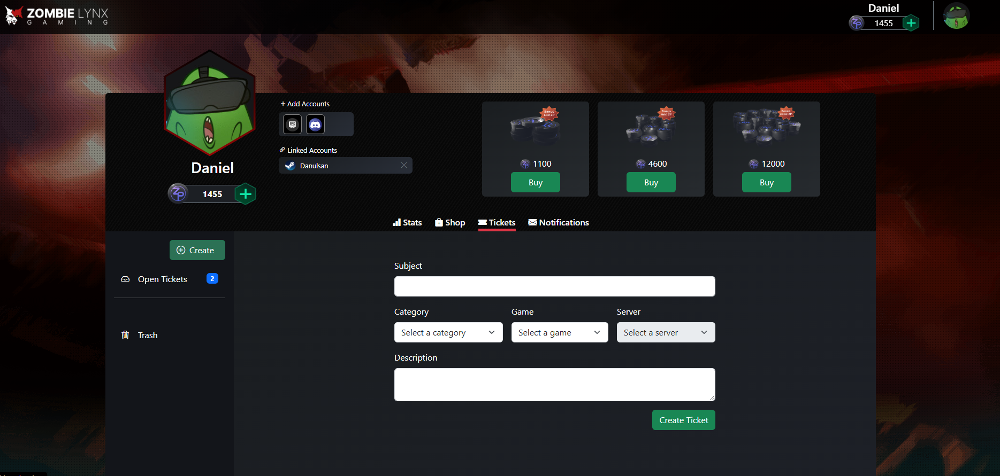
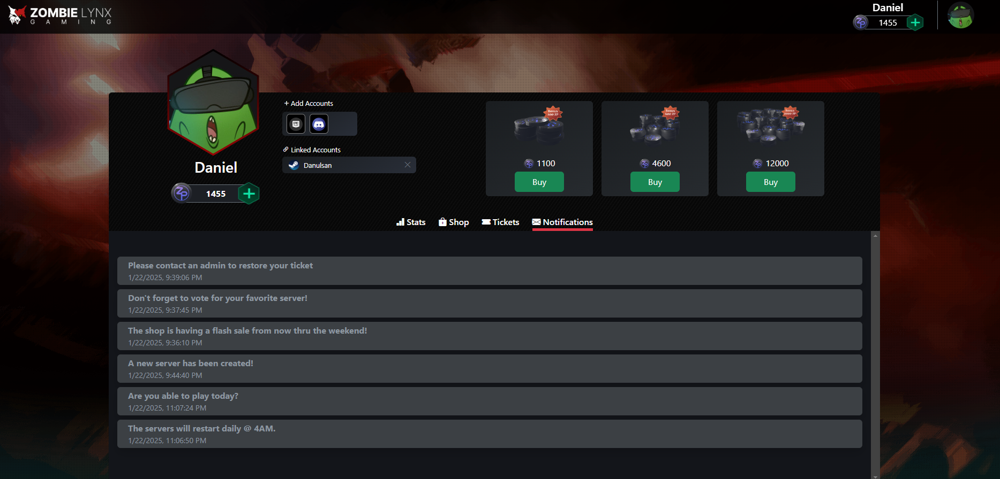
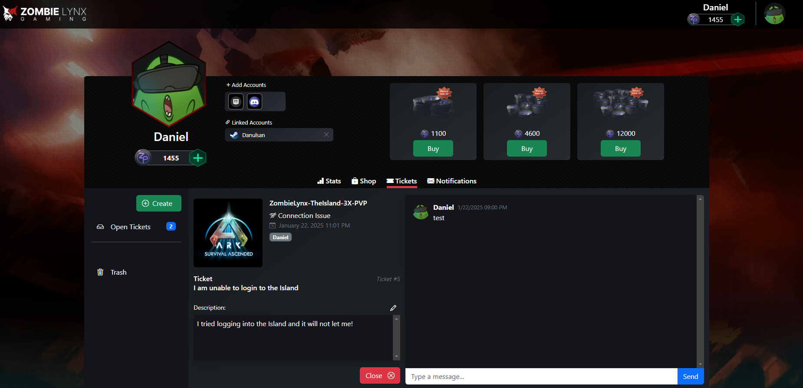

# Zombie Lynx Portal API

## Overview

Zombie Lynx Portal API is a .NET/React application that serves as a ticket and notification portal for players using Steam, Discord, and Epic. Users can login to the portal and submit a ticket and have an ongoing conversation for real issues that may occur throughout their time at Zombie Lynx Gaming. Zombie Lynx Portal API serves as a customer service portal as well as an admin portal. Admins can assign users to tickets and issue notifications to one, many, or all users of the platform.

### Screenshots

Below are some screenshots showcasing the features of the Zombie Lynx Portal:

- **Create Ticket**  
  

- **Notifications**  
  

- **Single Ticket View**  
  

- **Tickets Overview**  
  

## Features

- Ticket management system for player support
- Notification system integrated with Steam, Discord, and Epic
- User authentication and authorization
- RESTful API endpoints for seamless integration

## Technologies Used

- .NET Core for the backend API
- React for the frontend
- Entity Framework Core for database management
- JWT Authentication
- OpenID Login Integration with Steam, Discord, and Epic APIs (Discord and Epic coming soon!)

## What I Learned

During the development of the Zombie Lynx Portal API, I deepened my understanding of:

- **OpenID**: Explored how OpenID works for secure user authentication and how to integrate it with third-party services like Steam.
- **JWT**: Gained a comprehensive understanding of JWT (JSON Web Tokens), including how to generate, sign, validate, and use them effectively for user authentication and authorization.

## Goals for the Future

Looking ahead, here are some planned features and enhancements:

- **Connect to Discord.js**: Integrate the portal with Discord for richer community engagement and notifications.
- **Add a Shop**: Connect to existing in game shop for better UI/UX experience.
- **Integrate Stats Portal**: Connect to existing stats portal for single location solution for Zombie Lynx Gaming.
- **Data Analytics**: Track Admin response and resolution time and deliver in graphs per Admin.
- **Normalize Database Design** Check for redundancies in db design to improve integrity.
- **Unit Tests for all endpoints** Create simple unit testing to test all endpoints moving forward.

## Getting Started

To get started with the Zombie Lynx Portal API, follow these steps:

1. Clone the repository:

   ```bash
   git clone git@github.com:DanielHenderson-17/ZombieLynxPortal.git

   ```

2. Navigate to the project directory:

   ```bash
   cd ZombieLynxPortalAPI
   ```

3. Install the required dependencies:

   ```bash
   dotnet restore
   npm install
   ```

4. Update the configuration files with your API keys and connection strings.

5. Run the application:
   ```bash
   dotnet run
   npm start
   ```

## Contributing

Contributions are welcome! Please read the [contributing guidelines](CONTRIBUTING.md) before submitting a pull request.

## License

This project is licensed under the MIT License. See the [LICENSE](LICENSE) file for details.

ToDo:
popout menu to shop
bot not creating or closing tickets ? maybe token?
change tebex route on steam login
clear cart after purchase? Works for me
gray out button for promo
checkout rules container whitespace
