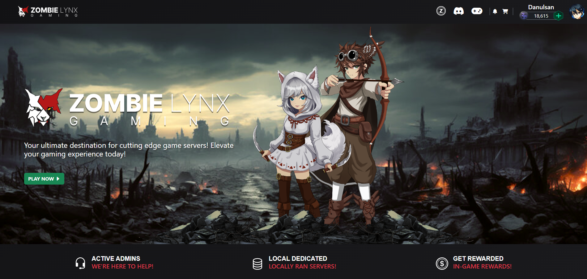
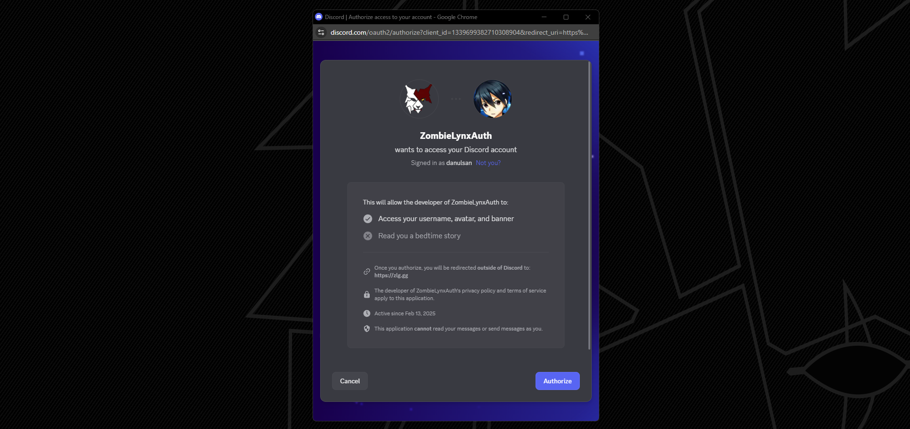
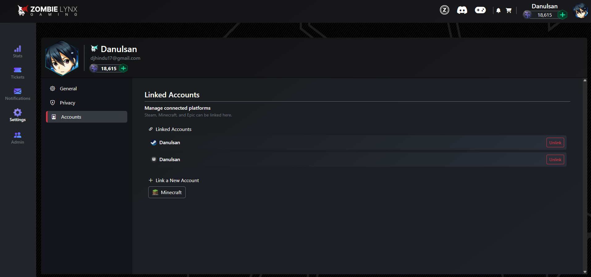
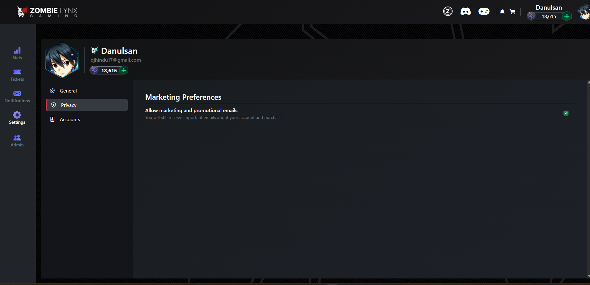
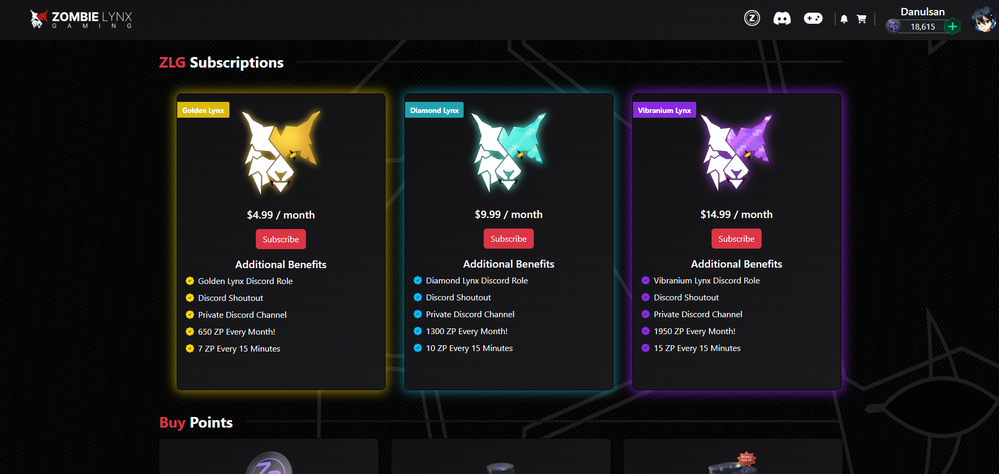
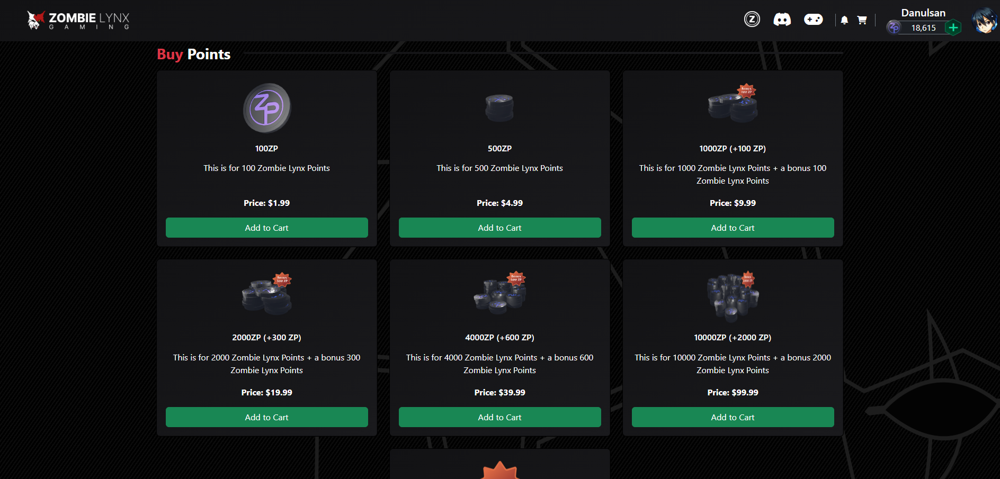
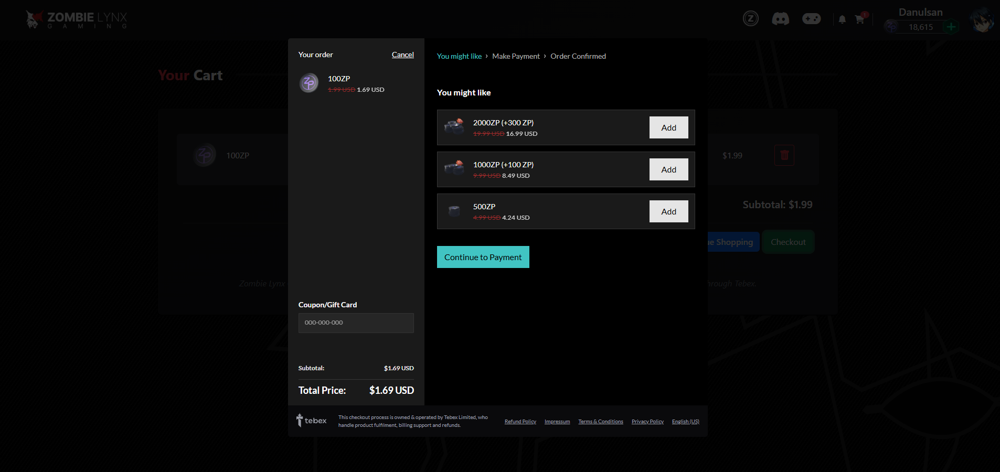
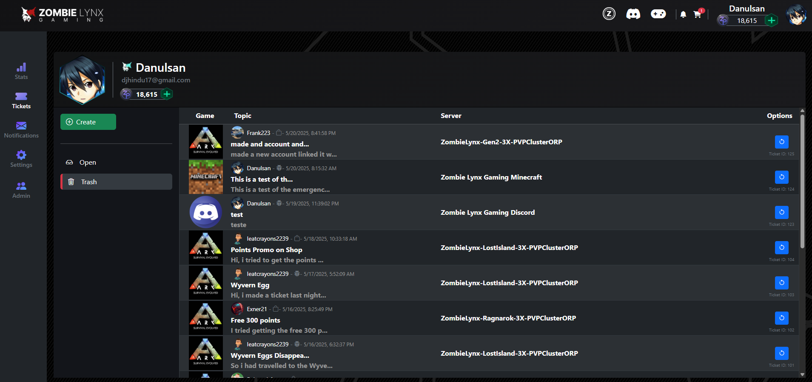
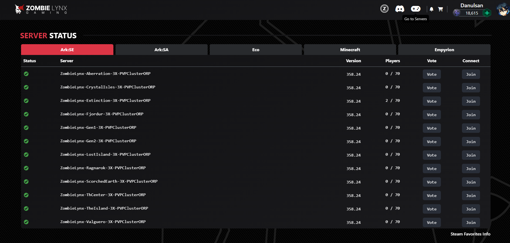
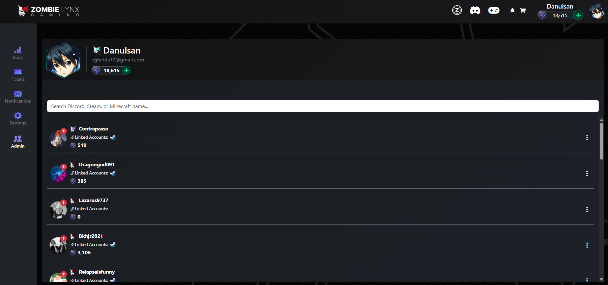

# 🧟 Zombie Lynx Gaming Web Portal

Welcome to the official web portal of **Zombie Lynx Gaming (ZLG)** — a centralized platform for game integration, community tools, and cross-title rewards. This project enables users to link their gaming accounts (Discord, Steam, etc.) and access exclusive perks across multiple games through a unified ZLG profile. The entire system is self hosted on my home server stack using a reverse proxy via Cloudflare and Nginx.

---

## 🔑 Authentication & Registration

- Supports login and registration using **Discord OAuth** and **Steam OpenID**.
- Also supports **email/password authentication** for standard login flow.
- JWT-based session management for secure, stateless authentication.

---

## 🎮 Game Account Linking & Profile Perks

- Users can **link multiple game accounts** (e.g. Steam, Minecraft, Epic) to their ZLG profile.
- Linking accounts unlocks **in-game perks and points synchronization**:
  - Earn points in **Ark: Survival Evolved** based on in-game actions.
  - Spend those points in **Minecraft** if your account is linked.
- Integrated **soft delete** feature: users can deactivate their ZLG account safely.
- Profile settings include:
  - Opt in/out of marketing emails.
  - Change password.
  - View and manage connected accounts.

---

## 🛒 Webstore Integration (Tebex)

- Fully implemented webstore using **Tebex.js** with the **Headless Tebex API**.
- Subscription and purchase data sync directly to ZLG user profiles.
- Purchases trigger confirmation emails with itemized HTML layouts.

---

## 📨 Email Notifications

- Integrated `IEmailSender` service.
- Sends transactional HTML emails:
  - Purchase confirmations
  - Subscription notices
  - Password resets
- Full opt-out management in the user profile.

---

## 🧾 Ticket System & Discord Integration

- Discord-based ticketing system integrated with the **Zombie Lynx Discord Bot** using `Discord.Net`.
- Real-time updates between the **Discord server** and **web portal** via **WebSocket**:
  - View live ticket updates
  - Reopen or close tickets
  - Add/remove users from ticket channels
- Supports full lifecycle management:

  - Ticket creation
  - Channel generation in Discord
  - Message syncing with frontend panel

---

## 🖥 Server Monitoring & Status

- View live server stats using external APIs:
  - **Ark:SE**, **Ark:SA**
  - **Minecraft**
  - **Empyrion**
  - **Eco**
- Results displayed on the portal dashboard for transparency and player tracking.

---

## ⚙️ Tech Stack & Architecture

- **Frontend**: React.js with custom-built components and hooks.
- **Backend**: ASP.NET Core with WebSocket support and REST APIs.
- **Databases**:
  - PostgreSQL (main database)
  - MySQL (external game-specific DBs)
- **EF Core** for ORM and migrations.
- **Nginx and Cloudflare** Reverse Proxy
- Custom **SQL triggers** ensure real-time point syncing across services and databases.

---

## 🛠 Admin Tools

- Fully functional admin dashboard:

  - Adjust user points manually
  - Promote or demote account statuses
  - View system logs and linked accounts

---

## 🧠 What I Learned

Throughout this capstone project, I gained hands-on experience with:

- **Self-hosting and deployment** using Nginx as a reverse proxy and Cloudflare for DNS management, HTTPS enforcement, and security features.
- Navigating the **complexity of OAuth callback URIs** across platforms like Discord and Steam, ensuring proper redirection and token flow in multi-environment setups.
- Building dynamic user interfaces in React using a wide range of **component libraries and custom Node packages**, handling state transitions, modals, forms, and real-time WebSocket updates.
- Managing and integrating **multiple databases** (PostgreSQL and MySQL) with EF Core, and using **SQL triggers** to sync game data across services in real-time.
- Architecting a **modular and scalable full-stack application**, balancing maintainability with performance across React frontend and .NET backend services.

These challenges provided valuable insights into real-world system design, integration across platforms, and the importance of clean code structure and extensibility.

---

## 🎯 Future Goals

- Integrate **per-game statistics tracking** and display within user profiles.
- Add a **Battle Pass system** to reward players for consistent gameplay.
- Expand server coverage and cross-game syncing features.
